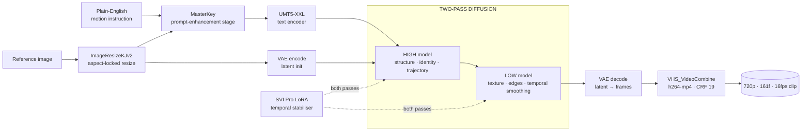

<div align="center">

# CineVerse

**A category-aware, two-pass diffusion pipeline that turns a single reference image and one line of plain-English motion into a photorealistic 720p video clip.**


</div>

---

> **Reference build:** NVIDIA A100-SXM4-80GB · CUDA 12.6 · Driver 535.183.06 · ComfyUI `v0.3.40` (pinned).
> All submitted clips are rendered at **720p** per guidelines. Switch to **480p** to roughly quarter the latent footprint and inference time — see [§ Resolution & Frame Budget](#-resolution--frame-budget).

---

## 📑 Contents

- [Why this pipeline exists](#-why-this-pipeline-exists)
- [Architecture at a glance](#-architecture-at-a-glance)
- [Pipeline structure — stage by stage](#-pipeline-structure--stage-by-stage)
- [Repository layout](#-repository-layout)
- [The five workflows — and why each one exists](#-the-five-workflows--and-why-each-one-exists)
- [Per-workflow tuning reference](#-per-workflow-tuning-reference)
- [Deep dives](#-deep-dives) — steps · split-sigmas · LoRA · token weighting · MasterKey
- [The node graph](#-the-node-graph)
- [Models & directory layout](#-models--directory-layout)
- [Running a generation](#-running-a-generation)
- [Reproducibility](#-reproducibility)
- [Resolution & frame budget](#-resolution--frame-budget)
- [Sample outputs](#-sample-outputs)
- [Troubleshooting](#-troubleshooting)

---

## 🎯 Why this pipeline exists

A single generic image-to-video graph cannot be optimal across every kind of subject. A ring, a human hand, a smartphone, and a stretch of yarn each fail in *different* ways — gemstone colour drift, finger fusion, hardware hallucination, physically impossible deformation. This project answers that with **five specialised graphs that share one backbone** but differ in their denoising budget, sampler split, temporal-LoRA strength, and prompt-shaping strategy.

The result is a deterministic, reproducible pipeline: the same **seed + image + instruction** always yields the same clip, and every run records the seed it used.

---

## 🧭 Architecture at a glance



Two model layers run in sequence. The first reshapes a terse instruction into a richly structured, attention-aware prompt; the second is a **dual-checkpoint Wan 2.2 diffusion** stack that splits the denoising schedule between a structural pass and a refinement pass, with a temporal-consistency LoRA applied throughout.

---

## 🔬 Pipeline structure — stage by stage

| # | Stage | Node(s) | Purpose |
|---|-------|---------|---------|
| 1 | **Ingestion** | `LoadImage` → `ImageResizeKJv2` | Accepts any resolution; resizes to the workflow's target canvas with aspect ratio preserved (`pad`, no content loss). |
| 2 | **Prompt enhancement** | `MasterKey` → `Ask_Gemini` | A category-specialist system prompt rewrites the raw instruction into a single continuous paragraph optimised for the text encoder's attention profile. The reference image conditions this rewrite, so identity details are grounded in pixels, not guessed. |
| 3 | **Text encoding** | `CLIPLoader` (UMT5-XXL) | Encodes the structured paragraph into the conditioning tensor that steers diffusion. |
| 4 | **Latent init** | `VAELoader` → `VAEEncode` | Encodes the reference image into latent space as the motion's anchor frame. |
| 5 | **Structural pass (HIGH)** | `DiffusionModelLoaderKJ` + `LoraLoaderModelOnly` + `ModelSamplingSD3` | The HIGH checkpoint denoises the high-noise steps, locking global geometry, subject identity, and motion trajectory. |
| 6 | **Schedule split** | `BasicScheduler` (beta) → `SplitSigmas` → `KSamplerSelect` | The sigma schedule is cut at step *N*; everything before *N* runs on HIGH, everything after on LOW. |
| 7 | **Refinement pass (LOW)** | `DiffusionModelLoaderKJ` + `LoraLoaderModelOnly` | The LOW checkpoint finishes the low-noise steps — texture, edge sharpness, frame-to-frame temporal smoothness. |
| 8 | **Temporal stabilisation** | SVI Pro LoRA (HIGH + LOW) | Applied on **both** passes to suppress flicker and stabilise motion trajectories. Strength is tuned per category (see below). |
| 9 | **Decode & assemble** | `VAEDecode` → `VHS_VideoCombine` | Latents become pixel frames, then an h264-mp4 at CRF 19, 16 fps. |

> `RegexReplace` and `PreviewAny` nodes are present on the canvas for inspection and an optional multi-scene extension path. They are **bypassed** in every submitted generation and play no role in the active pipeline.

---

## 📁 Repository layout

```
perry-wan-pipeline/
│
├── README.md                       ← this document
├── QUICKSTART.md                   ← condensed run-now guide
├── requirements.txt                ← pinned Python dependencies
├── extra_model_paths.yaml          ← tells ComfyUI where models live
├── run_inference.py                ← deterministic CLI runner (seed-logged)
│
├── scripts/
│   ├── setup_comfyui.sh            ← clones + pins ComfyUI, installs the stack
│   ├── start_comfyui.sh            ← launcher with VRAM auto-detection
│   ├── download_models.py          ← fetches the shared weights
│   └── verify_setup.py             ← pre-flight: GPU, models, custom nodes
│
├── workflows/                      ← five category-specialist graphs
│   ├── jewellery_workflow.json
│   ├── people_workflow.json
│   ├── tech_workflow.json
│   ├── close_workflow.json
│   └── universal_workflow.json
│
└── Videos/                         ← 70 rendered sample outputs (h264-mp4)
```

**`scripts/`** is the operational layer — bootstrap, launch, fetch, and validate, so the environment is reproducible on any NVIDIA host. **`workflows/`** is the creative layer — each JSON is a complete, self-describing ComfyUI graph. **`Videos/`** holds rendered proof: 70 finished clips straight out of the pipeline.

---

## 🗂 The five workflows — and why each one exists

```
What does your reference image show?
│
├── Jewelry, gemstone, or watch ............ jewellery_workflow.json
├── Person with face or torso visible ...... people_workflow.json
├── Phone / tablet / laptop / console ...... tech_workflow.json
├── Hands-only, object physics, materials .. close_workflow.json
└── Unsure / mixed batch ................... universal_workflow.json
```

| Workflow | Built for | The failure it's tuned against | Key adaptation |
|----------|-----------|--------------------------------|----------------|
| **Jewellery** | Rings, earrings, watches, gemstones | Gemstone colour drift, metal-tone shift | Portrait 9:16 canvas, expressive light-physics prompting, hard geometry lock |
| **People** | Cooking, demos, crafting — face/torso visible | Face morphing, skin-tone drift, hand warping | 4-part identity-anchored prompt, anatomy rules, lock block at prompt tail |
| **Tech** | Smartphones, tablets, laptops, consoles | Six documented hardware-hallucination modes | Reduced LoRA strength to keep edges crisp, longest denoise + widest split |
| **Close** | Hands-only, cutting, flexible materials | Object teleporting, broken cause-and-effect | Causal-chain prompt structure, physics-consequence enforcement |
| **Universal** | Unknown / mixed batches | Everything above, at shallower depth | Self-classifies into one of four types, applies condensed specialist rules |

> **Rule of thumb:** if you know the category, always pick the specialist. Universal is a routing fallback for ambiguous or batch inputs and trades a little fidelity for coverage.

---

## ⚙️ Per-workflow tuning reference

Every value below is extracted directly from the workflow JSON — nothing is approximate.

| Workflow | Steps | SplitSigmas | LoRA HIGH | LoRA LOW | Canvas | Why these numbers |
|----------|------:|------------:|----------:|---------:|--------|-------------------|
| **Jewellery** | 6 | 2 | 1.0 | 1.0 | 404 × 720 | Smooth orbits + simple backgrounds plateau in quality fast |
| **People** | 8 | 2 | 1.0 | 1.0 | 1280 × 720 | Face identity needs more steps; scene complexity moderate |
| **Universal** | 9 | 3 | 0.85 | 0.95 | 1280 × 720 | Midpoint budget; LoRA pulled below 1.0 to avoid over-smoothing |
| **Close** | 10 | 3 | 1.0 | 1.0 | 1280 × 720 | Causal physics continuity needs extra denoising budget |
| **Tech** | 12 | 5 | 0.6 | 0.8 | 1280 × 720 | Hardware identity is the hardest to hold; widest split, softest LoRA |

All five share the same output contract: **161 frames · 16 fps · ~10 s · h264-mp4 · CRF 19**.

---

## 🧪 Deep dives

<details>
<summary><b>Denoising steps &amp; the beta scheduler</b></summary>

Steps are the number of denoising iterations. More steps give the model more chances to refine identity, geometry, and motion — at a linear time cost. The **beta** scheduler front-loads budget onto the critical high-noise early steps where global structure and identity are set, making it more efficient than a uniform schedule at the same step count.

| Workflow | Steps | Rationale |
|----------|------:|-----------|
| Jewellery | 6 | Simple backgrounds, smooth orbits — quality plateaus quickly |
| People | 8 | Face identity demands more; scene complexity moderate |
| Universal | 9 | General-purpose midpoint |
| Close | 10 | Causal physics continuity needs more budget than identity alone |
| Tech | 12 | Hardware hallucination is the hardest suppression problem here |

</details>

<details>
<summary><b>SplitSigmas — the two-pass HIGH/LOW architecture</b></summary>

`SplitSigmas = N` cuts the schedule into two phases handled by two different checkpoints:

```
steps 1 … N        →  HIGH model   (global structure, identity, motion trajectory)
steps N+1 … end    →  LOW model    (texture, edge sharpness, temporal smoothness)
```

| Workflow | Steps | Split | HIGH steps | LOW steps |
|----------|------:|------:|:----------:|:---------:|
| Jewellery | 6 | 2 | 1–2 | 3–6 |
| People | 8 | 2 | 1–2 | 3–8 |
| Close | 10 | 3 | 1–3 | 4–10 |
| Universal | 9 | 3 | 1–3 | 4–9 |
| Tech | 12 | 5 | 1–5 | 6–12 |

Tech spends 5 of 12 steps on HIGH because hardware identity (logo, port type, camera configuration) must be locked during the structural pass. Using both checkpoints in sequence beats either one alone on temporal consistency.

</details>

<details>
<summary><b>SVI Pro LoRA — temporal stabilisation vs. edge sharpness</b></summary>

The SVI Pro LoRA (`SVI_v2_PRO_Wan2.2-I2V-A14B`) reduces frame-to-frame flicker and stabilises motion trajectories. At full strength (1.0) it introduces mild high-frequency softening through latent smoothing.

- **Jewellery / People / Close** → 1.0 on both passes; the temporal benefit outweighs the softening.
- **Tech** → HIGH 0.6 / LOW 0.8; screen text, bezels, camera-bump outlines and port shapes are identity-critical, so crispness is preserved while keeping enough stabilisation to stop flicker.
- **Universal** → 0.85 / 0.95; a safe midpoint across unknown content.

</details>

<details>
<summary><b>UMT5-XXL token weighting — why prompt order matters</b></summary>

The text encoder reads the prompt as one flat token sequence; it does **not** parse headers or bullets. Attention weight decays with position:

```
first 30%  →  ~100% attention     ← primary subject + primary action verb live here
middle 40% →  ~50–60% attention   ← camera, environment, lighting
final 30%  →  ~20–30% attention   ← all lock / consistency language goes here only
```

This is why every MasterKey emits a **single continuous paragraph**, leads with the subject and its motion, and concentrates "do not change" statements at the very end — lock language placed earlier reads as "suppress motion." Target length is **70–180 words**; beyond that, each extra word dilutes the identity anchors that matter most.

</details>

<details>
<summary><b>MasterKey — category-specialist prompt shaping</b></summary>

The `MasterKey` node holds a specialist system prompt. It receives the reference image and the raw instruction and returns the final, structured generation prompt that feeds UMT5-XXL.

- **Jewellery** → 3-part (appearance anchor → lighting lock → camera/motion) with 15 rules, gemstone-colour and metal-finish locks.
- **People** → 4-part (identity anchor → action mechanics → environment → lock block) with explicit five-finger anatomy.
- **Tech** → device-fingerprint extraction (cutout type, camera count, port, logo) plus six anti-hallucination pre-empts, one per known failure mode.
- **Close** → causal chain ("scissors open → blades contact → material separates") with a mandatory cause-and-effect rule to defeat static loops.
- **Universal** → classifies the input into one of the four types, then applies a condensed version of that specialist's rules.

</details>

---

## 🕸 The node graph

Each workflow is a 50-node ComfyUI graph. The functional spine:

```
LoadImage ─► ImageResizeKJv2 ─► VAEEncode ─┐
                              │            ▼
   instruction ─► MasterKey ─► Ask_Gemini ─► CLIPLoader (UMT5-XXL) ─► conditioning
                              │
   DiffusionModelLoaderKJ(HIGH) + LoraLoaderModelOnly ─► ModelSamplingSD3 ─┐
   DiffusionModelLoaderKJ(LOW)  + LoraLoaderModelOnly ────────────────────┤
                              │                                            ▼
   BasicScheduler(beta) ─► SplitSigmas ─► KSamplerSelect ─► VAEDecode ─► VHS_VideoCombine
```

`GetNode` / `SetNode` pairs route signals cleanly across the canvas; `PreviewAny` taps let you inspect the enhanced prompt mid-graph. The wiring is identical across all five workflows — only the tuning constants differ.

---

## 💾 Models & directory layout

The graphs expect a dual-checkpoint Wan 2.2 stack plus a shared VAE, text encoder, and the SVI Pro LoRA pair. `scripts/download_models.py` fetches the shared weights; the large checkpoints are placed once into:

```
models/
├── diffusion_models/
│   ├── smoothMixWan2214BI2V_i2vHigh.safetensors   (~27 GB)
│   └── smoothMixWan2214BI2V_i2vLow.safetensors    (~27 GB)
├── vae/
│   └── wan_2.1_vae.safetensors                    (~400 MB)
├── text_encoders/
│   └── umt5_xxl_fp16.safetensors                  (~10 GB)
└── loras/
    ├── SVI_v2_PRO_Wan2.2-I2V-A14B_HIGH_lora_rank_128_fp16.safetensors  (~1.5 GB)
    └── SVI_v2_PRO_Wan2.2-I2V-A14B_LOW_lora_rank_128_fp16.safetensors   (~1.5 GB)
```

`extra_model_paths.yaml` points ComfyUI at this tree. Validate everything with `python3 scripts/verify_setup.py` before your first run. Weights are intentionally **not** committed to this repository — they are fetched into `models/` (git-ignored).

---

## ▶️ Running a generation

**1 — Bring up the engine** (leave it running):

```bash
bash scripts/setup_comfyui.sh      # first time only — clones + pins ComfyUI, installs the stack
python3 scripts/verify_setup.py    # confirm GPU, models, and custom nodes are present
bash scripts/start_comfyui.sh      # auto-detects VRAM and picks memory flags
```

**2 — Render deterministically from the CLI** (recommended):

```bash
python3 run_inference.py \
    --workflow workflows/jewellery_workflow.json \
    --image    inputs/my_ring.jpg \
    --prompt   "Camera slowly orbits the gold ring, highlighting the diamond facets." \
    --seed     42
```

The runner uploads the image, patches the graph (`mode=fixed`, injects the seed), queues the job, waits for completion, and appends a reproducibility record to `seed_log.txt`. Omit `--seed` to draw a random one — it is printed and logged.

**Or drive it in the ComfyUI web UI:** drag a workflow `.json` onto the canvas, point `LoadImage` at your reference, type a short instruction into the prompt-enhancement node, set its mode to `fixed`, and hit **Queue Prompt**. Keep instructions short — the MasterKey expands them:

```
Jewellery : "Camera slowly orbits the gold ring, highlighting the diamond facets."
People    : "Person slices carrots on a wooden cutting board with deliberate strokes."
Tech      : "Hand picks up the phone and tilts it to show the titanium back."
Close     : "Scissors open and cut through bubble wrap, popping cells as they close."
Universal : "The ring rotates slowly on a velvet stand under studio lighting."
```

---

## 🔁 Reproducibility

The workflow JSON is the complete reproducibility artifact — it encodes sampler settings, scheduler parameters, LoRA filenames and strengths, step counts, the SplitSigmas value, resolution, and the full MasterKey system prompt. Given the same **model files + node versions + seed + image + instruction**, output is deterministic.

```
2026-06-22 11:30:00  workflow=jewellery_workflow.json  image=my_ring.jpg  seed=42  job_id=abc123
```

Every CLI run appends a line like this to `seed_log.txt`. To reproduce any clip exactly, re-run with its recorded seed.

**Verified environment**

```
GPU     : NVIDIA A100-SXM4-80GB        Python  : 3.10.x
Driver  : 535.183.06                   PyTorch : 2.5.1+cu124
CUDA    : 12.6                         ComfyUI : v0.3.40 (pinned)
OS      : Ubuntu 22.04
```

---

## 🎚 Resolution & frame budget

Default output is **720p · 161 frames · ~10 s**. Trade quality for speed by dropping resolution and/or frames in the `ImageResizeKJv2` and scheduler nodes:

```
Landscape (People / Tech / Close / Universal):  1280×720 → 854×480
Jewellery portrait:                              404×720  → 228×405      (aspect preserved)

161 frames = ~10 s  (default)        97 frames = ~6 s  (~40% faster)        65 frames = ~4 s  (~60% faster)
```

| Configuration | Approx. VRAM | Notes |
|---------------|:-----------:|-------|
| BF16 @ 720p · 161f | ~55–65 GB | Best quality — the tested config |
| BF16 @ 480p · 161f | ~35–45 GB | Strong quality |
| FP8 @ 720p · 161f | ~28–35 GB | Slight softening |
| FP8 @ 480p · 161f | ~18–22 GB | Comfortable on mid-range cards |
| FP8 @ 480p + `--lowvram` | ~14–16 GB | Functional on 16 GB GPUs |

Identity-fidelity metrics are per-frame, so reducing the frame count does not lower per-frame scores.

---

## 🎞 Sample outputs

The [`Videos/`](Videos/) directory holds **70 finished clips** rendered straight from these workflows — across jewelry, people, tech, and object-physics subjects. They are the pipeline's output contract in practice: 720p, 16 fps, h264-mp4 at CRF 19. Browse them to see how each specialist workflow handles its target category.

---

## 🩺 Troubleshooting

<details>
<summary><b>Video is frozen / a static image</b></summary>

The most common failure. Check, in order:
- The prompt-enhancement node (`MasterKey`) is connected and not muted.
- The instruction contains a real motion verb — *"a ring on a stand"* gives the model nothing; *"camera orbits slowly around the ring"* does.
- You picked the right specialist — running jewelry through the tech graph degrades motion.

</details>

<details>
<summary><b>CUDA out of memory</b></summary>

- Check `nvidia-smi` for other processes holding VRAM.
- Drop to 480p (≈4× smaller latent).
- Add `--lowvram` to `scripts/start_comfyui.sh`.
- Switch to FP8 checkpoints.

</details>

<details>
<summary><b>Model file not found</b></summary>

Run `python3 scripts/verify_setup.py`. Filenames are case-sensitive on Linux (`_i2vHigh` ≠ `_i2vhigh`), and `extra_model_paths.yaml` must point at the correct `models/` tree.

</details>

<details>
<summary><b>Fingers fused / malformed</b></summary>

Seen in close/people graphs when LoRA strength drops below 1.0. Confirm both LoRA HIGH and LOW are at 1.0; if it persists, add 2 steps (close 10→12, people 8→10).

</details>

<details>
<summary><b>Hardware hallucinations in tech output</b></summary>

Confirm `tech_workflow.json` is loaded, the reference image shows the device's hardware clearly (blurry inputs weaken the fingerprint), and the prompt-enhancement node is connected.

</details>

<details>
<summary><b>Black bars in the output</b></summary>

Expected when the reference image isn't the target aspect ratio — `pad` keeps all content with bars. To crop instead, set `keep_proportion` to `crop_to_fit` in `ImageResizeKJv2` (note: cropping can remove subject detail and hurt identity fidelity).

</details>

---

<div align="center">

**Built around ComfyUI · Wan 2.2 · UMT5-XXL · SVI Pro LoRA**

*Five graphs, one backbone, deterministic output.*

</div>
